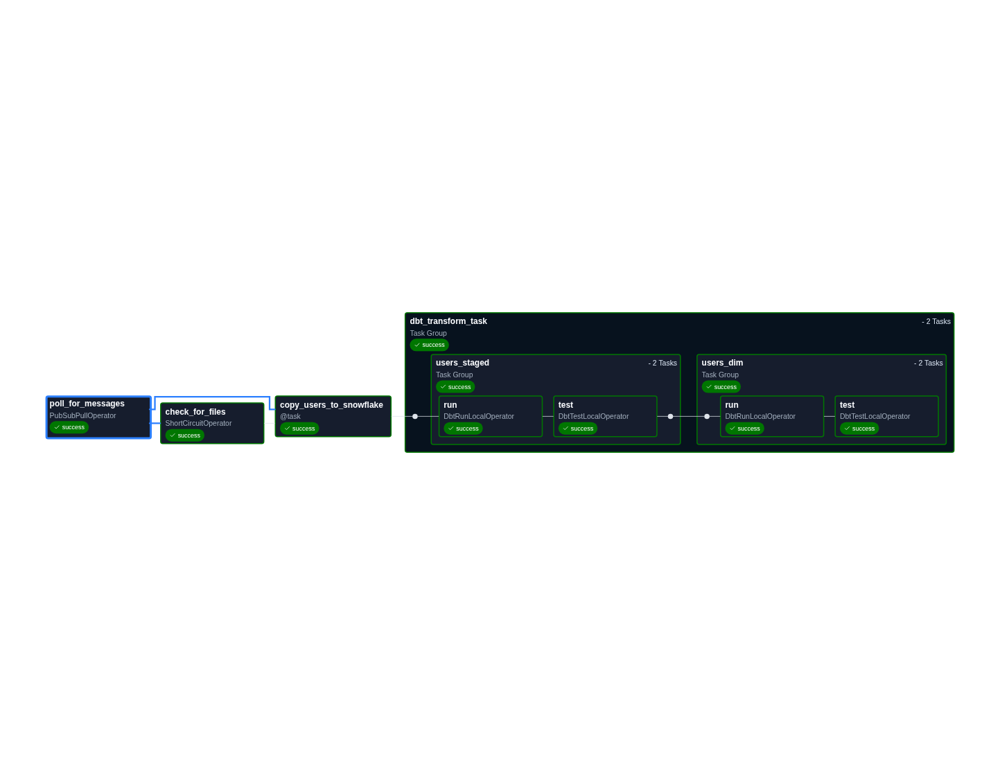
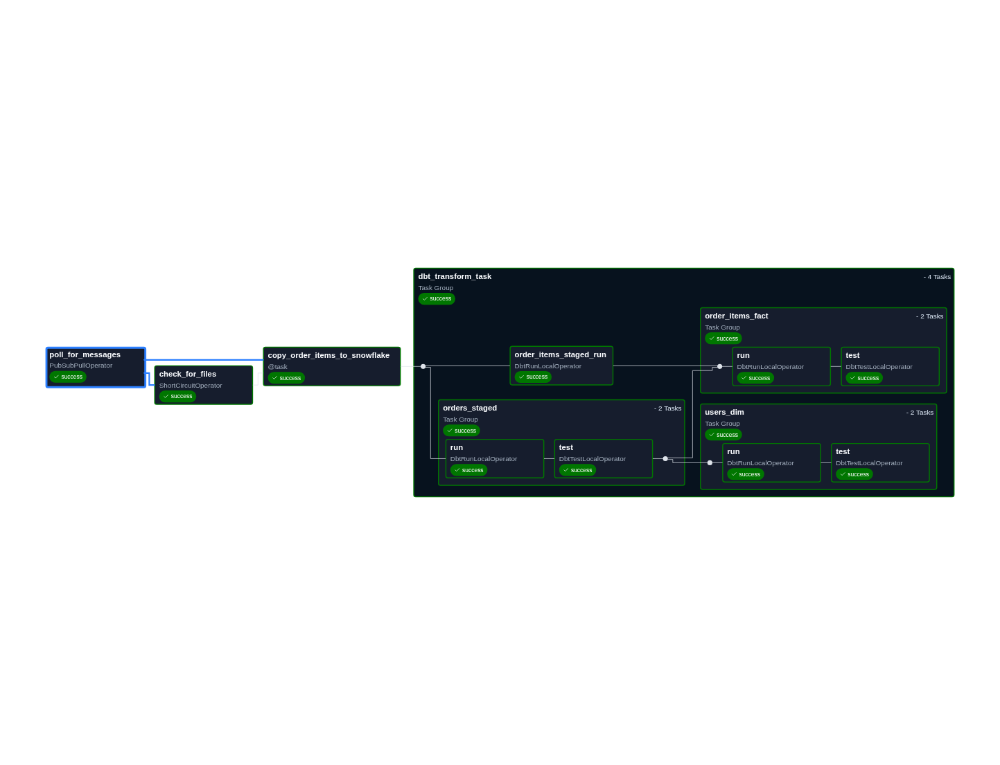

# Snowflake + dbt + Airflow: End-to-End Data Engineering Pipeline

This repository serves as a reference architecture for a modern data stack. It demonstrates a robust ELT pipeline where raw CSV data is ingested into Snowflake, transformed using dbt, and orchestrated via Apache Airflow.

## Project Overview

The architecture focuses on high data quality, automated documentation, and native orchestration.

* **Ingestion:** CSV files are hosted in **Google Cloud Storage (GCS)** and ingested into **Snowflake** via External Stages.
* **Snowflake:** Functions as the centralized Cloud Data Warehouse.
* **dbt (data build tool):** Handles the transformation layer, including:
    * **SCD Type 2** logic for dimensions.
    * Creation of final **Fact/Dimension** tables.
    * **Mart Layer:** A business-ready layer providing high-level metrics (e.g., Top Users, Time Between Orders).
* **Airflow (Astronomer):** Orchestrates the entire workflow. It utilizes the **astronomer-cosmos** SDK to render dbt models as native Airflow tasks.
* **Data Source:** Synthetic dataset sourced from Kaggle, but it can also be found under the data directory.

### Key Features
* **Custom SCD2 Logic:** Instead of using standard dbt snapshots, this project implements custom SCD2 logic to transform and merge data directly, avoiding unnecessary intermediate tables.
* **Business Intelligence Marts:** Specialized models designed for reporting, featuring complex window functions to calculate behavior metrics like user purchase frequency.
* **Data Quality:** Includes comprehensive unit tests and data tests using `dbt-expectations`.
* **Enhanced Orchestration:** By using Astronomer over GCP Composer, the project benefits from Airflow 3.1 features and a superior local development experience.

---

## Architecture & DAG Flow

The Airflow DAGs are broken down by functional area. Below are the visual representations of the task dependencies:

### Dimension Table Pipeline

* Both `users_dim` and `products_dim` are generated using similar pipelines.

### Fact & Mart Table Pipeline

* Following the Fact table creation, the **Mart** layer generates business metrics such as:
    * **Top Users:** Ranked by lifetime value and order volume.
    * **Time Between Orders:** Calculating customer retention and purchase cycles.

---

## Getting Started

Follow these steps to set up and run the reference project:

1.  **Snowflake Setup:**
    Execute the scripts located in `snowflake-setup/*.sql`.
    > **Note:** Ensure you replace all placeholders (e.g., `STORAGE_ALLOWED_LOCATIONS = ('gcs://your-bucket-name/')`) before execution.

2.  **dbt Configuration:**
    Generate a `profiles.yml` file for the dbt project to connect to your Snowflake instance.

3.  **Cloud Infrastructure:**
    Refer to `gcp-permissions.sh` to configure the necessary GCP IAM roles and **GCS buckets** required for the raw CSV data ingestion.

4.  **Local Airflow Development:**
    Install the [Astro CLI](https://www.astronomer.io/docs/astro/cli/overview), and update the volume path in `docker-compose.override.yml`. Once installed, navigate to the project root and run:
    ```bash
    astro dev start
    ```

---

## Testing & Quality Control

Testing is integrated into the heart of the transformation process. Data quality checks are executed immediately after data is loaded into respective tables:
* **Unit Tests:** Validating transformation logic on small scale.
* **Data Tests:** Leveraging `dbt-expectations` to ensure schema integrity and value distribution.
* **Documentation:** Auto-generated dbt docs to maintain a searchable data catalog.

---

## Production Readiness Roadmap

While this is a functional reference architecture, the following enhancements are recommended for a production-grade environment:

* **Infrastructure Optimization:** Right-size Snowflake warehouses and implement clustering for high-volume datasets.
* **Security (Least Privilege):** Fine-tune the `TRANSFORM` role and apply restrictive Network Policies for the `dbt_user`.
* **Event-Driven Ingestion:** Transition from polling-based DAG triggers to event-driven triggers (e.g., via GCS Pub/Sub notifications to Snowflake Snowpipe).
* **Observability:** Implement automated alerting (Slack/PagerDuty) specifically for dbt test failures to ensure immediate remediation.